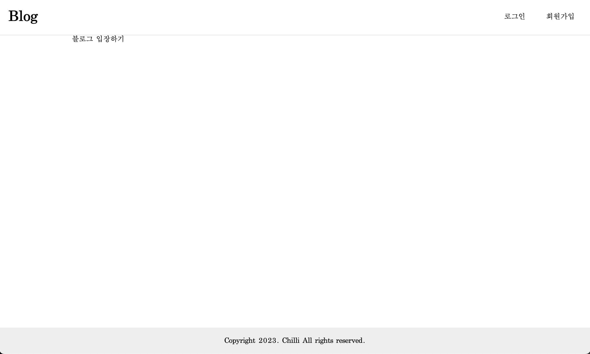
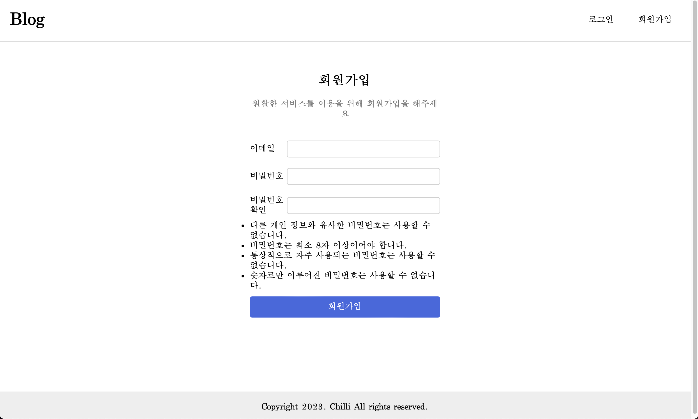
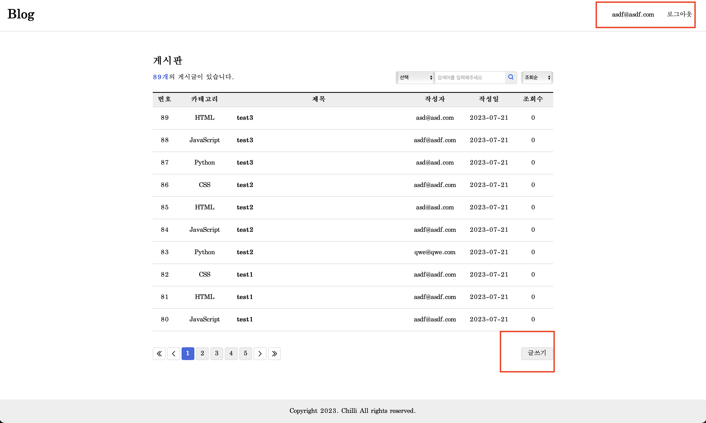
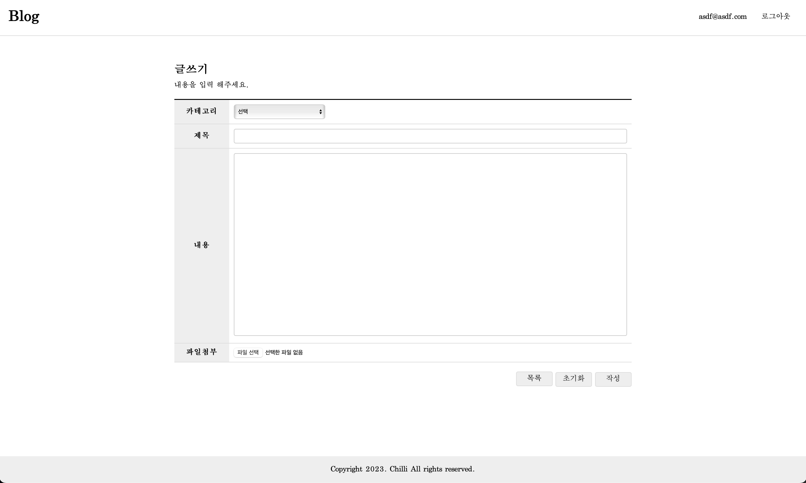
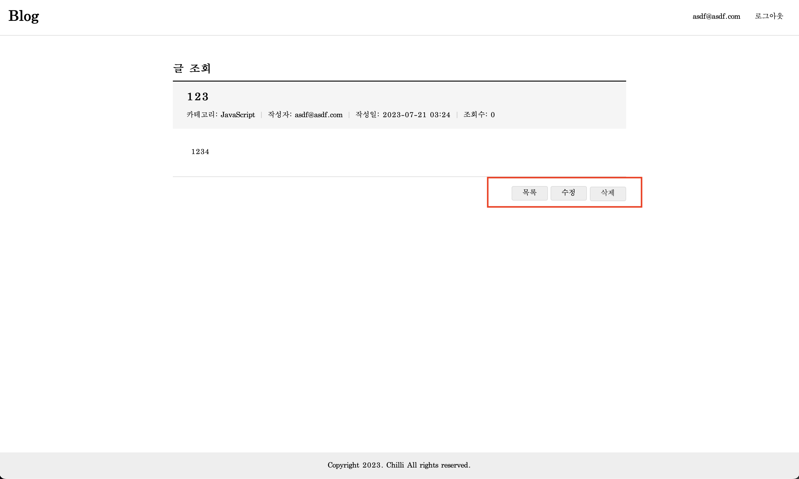
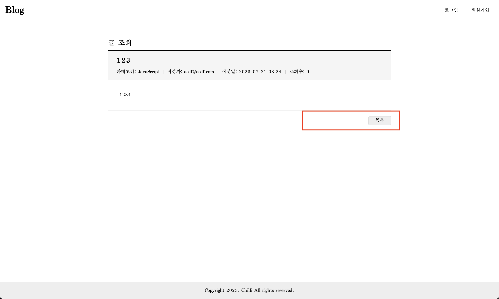
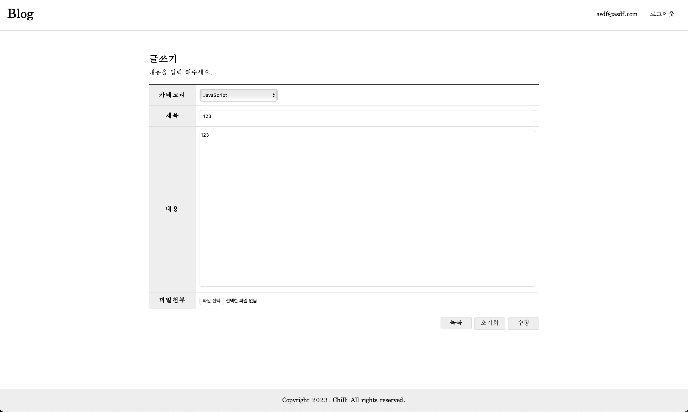
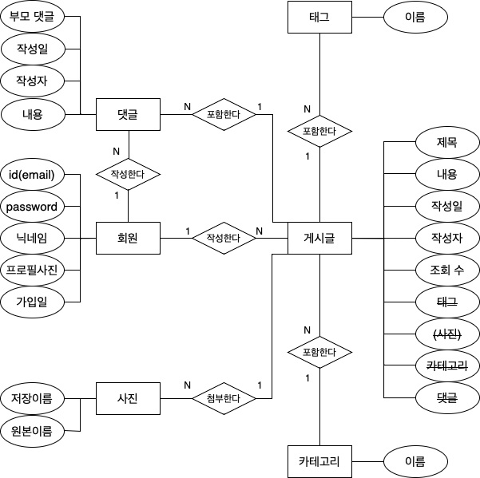
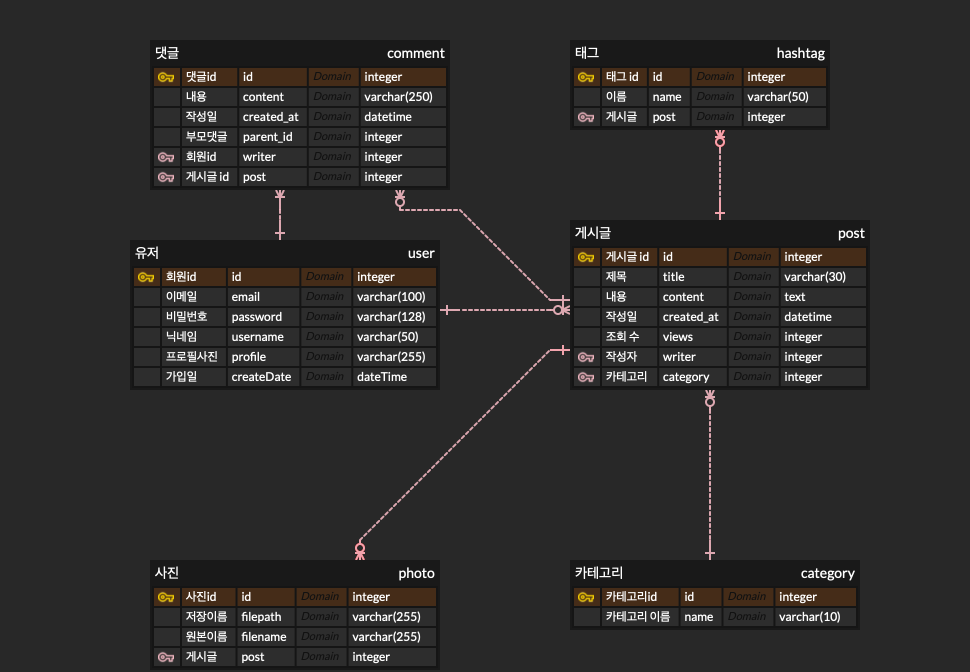

# Django-blog

## 1. 목표와 기능

### 1.1 목표
- 게시글을 작성하고 댓글로 의견을 나눌 수 있는 서비스를 제공합니다.

### 1.2 기능
- 회원가입, 로그인
- 게시글 작성, 수정, 삭제
- 게시글 검색

## 2. 개발 환경 및 개발 기간
- 개발 환경 : Python 3, Django 4.2.3, HTML, CSS, JavaScript
- 개발 기간 : 2023년 7월 17일 ~ 2023년 7월 20일

## 3. 프로젝트 구조

```bash
├── README.md
│
├── manage.py
├── djangoblog
│   ├── __init__.py
│   ├── asgi.py
│   ├── settings.py
│   ├── urls.py
│   ├── views.py
│   └── wsgi.py
├── blog
│   ├── static
│   │   └── blog
│   │       └── css
│   │           ├── list.css
│   │           ├── table.css
│   │           ├── view.css
│   │           └── write.css
│   ├── templates
│   │   └── blog
│   │       ├── post_404.html
│   │       ├── post_detail.html
│   │       ├── post_edit.html
│   │       ├── post_form.html
│   │       └── post_list.html
│   ├── __init__.py
│   ├── admin.py
│   ├── apps.py
│   ├── forms.py
│   ├── models.py
│   ├── tests.py
│   ├── urls.py
│   └── views.py
├── user
│   ├── static
│   │   └── user
│   │       └── css
│   │           └── login-join.css
│   ├── templates
│   │   └── user
│   │       ├── user_login.html
│   │       └── user_register.html
│   ├── __init__.py
│   ├── admin.py
│   ├── apps.py
│   ├── forms.py
│   ├── models.py
│   ├── tests.py
│   ├── urls.py
│   └── views.py
├── static
│   ├── css
│   │   ├── chat.css
│   │   └── common.css
│   └── img
│       ├── est.jpg
│       ├── first.png
│       ├── icon-search.png
│       ├── icon-x.png
│       ├── last.png
│       ├── licat.png
│       ├── next.png
│       └── prev.png
└── templates
    ├── base.html
    └── index.html
```

## 4. UI / 사용 예제

- 메인



- 회원가입



- 로그인


- 리스트
  - header 활성화 버튼
    - 로그인 유저: 유저 E-mail, 로그아웃
    - 비로그인 유저: 로그인, 회원가입
  - 비회원 글쓰기 버튼 비활성화

 

- 글쓰기
  - 카테고리, 제목, 내용 입력



- 게시글 조회
  - 작성자: 수정, 삭제 버튼 활성화

 

- 게시글 수정



- 검색
  - 카테고리, 제목 검색 가능


## 5. 데이터베이스 모델링

- Peter-Chen 표기법



- IE 표기법




## 6. 추가 개선 사항
### UI 개선

### 기능 추가
#### 게시글
- 댓글(대댓글)
- 게시글 사진 첨부
- 조회 수
- 게시판 추가 기능

#### 유저
- 프로필 사진 추가
- 유저 정보 수정